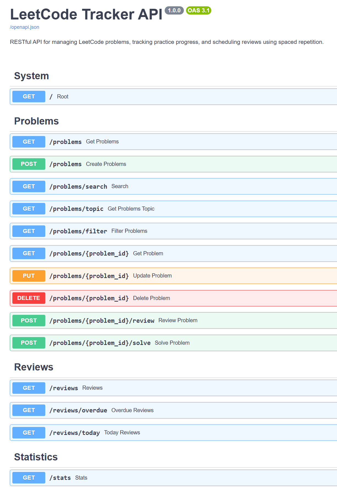

# LeetCode Tracker

A RESTful API built with FastAPI for tracking LeetCode practice, review progress, and spaced repetition schedules.

## API Preview



---

## Features

- RESTful API built with FastAPI
- Full CRUD operations for LeetCode problems
- Search problems by title
- Filter problems by difficulty
- Filter problems by topic
- Mark problems as solved
- Track review history
- Detect overdue reviews using a spaced repetition schedule
- View practice statistics
- Prevent duplicate problem entries
- Interactive Swagger API documentation
- Dockerized deployment with Docker Compose
- Persistent SQLite storage using Docker volumes

---

## Tech Stack

- Python 3
- FastAPI
- SQLite
- Pydantic
- Docker
- Docker Compose

---

## Project Structure

```text
leetcode-tracker/
├── data/
│   ├── .gitkeep
│   └── problems.db        # Generated automatically (ignored by Git)
├── api.py                 # REST API endpoints
├── services.py            # Business logic
├── database.py            # Database initialization and connection management
├── Dockerfile
├── docker-compose.yml
├── requirements.txt
├── .dockerignore
├── .gitignore
└── README.md
```

> **Note:** `data/problems.db` is generated automatically at runtime and is excluded from version control.

---

## Installation

Clone the repository:

```bash
git clone https://github.com/Joeytnc/leetcode-tracker.git
cd leetcode-tracker
```

Install dependencies:

```bash
pip install -r requirements.txt
```

Initialize the database (local development only):

```bash
python database.py
```

Run the application:

```bash
uvicorn api:app --reload
```

API:

```text
http://localhost:8000
```

Swagger UI:

```text
http://localhost:8000/docs
```

---

## Run with Docker

Build and start the application:

```bash
docker compose up --build
```

Stop the application:

```bash
docker compose down
```

The SQLite database is automatically created and persisted at:

```text
data/problems.db
```

---

## API Endpoints

| Method | Endpoint | Description |
|---------|----------|-------------|
| GET | / | API status |
| POST | /problems | Add a new problem |
| GET | /problems | Retrieve all problems |
| GET | /problems/{id} | Retrieve a problem by ID |
| PUT | /problems/{id} | Update a problem |
| DELETE | /problems/{id} | Delete a problem |
| GET | /problems/search | Search problems by title |
| GET | /problems/filter | Filter problems by difficulty |
| GET | /problems/topic | Filter problems by topic |
| POST | /problems/{id}/solve | Mark a problem as solved |
| POST | /problems/{id}/review | Record a review |
| GET | /reviews | Retrieve review history |
| GET | /reviews/overdue | Retrieve overdue reviews |
| GET | /reviews/today | Retrieve today's review list |
| GET | /stats | Retrieve practice statistics |

---

## Roadmap

- Pagination
- Sorting
- Unit testing
- CI/CD pipeline
- Cloud deployment

---

## Learning Outcomes

This project demonstrates:

- RESTful API development with FastAPI
- CRUD operations and layered application architecture
- SQLite database management
- Database connection abstraction
- Request validation with Pydantic
- Spaced repetition scheduling logic
- Docker containerization
- Docker Compose with persistent data volumes
- Backend project organization and modular design